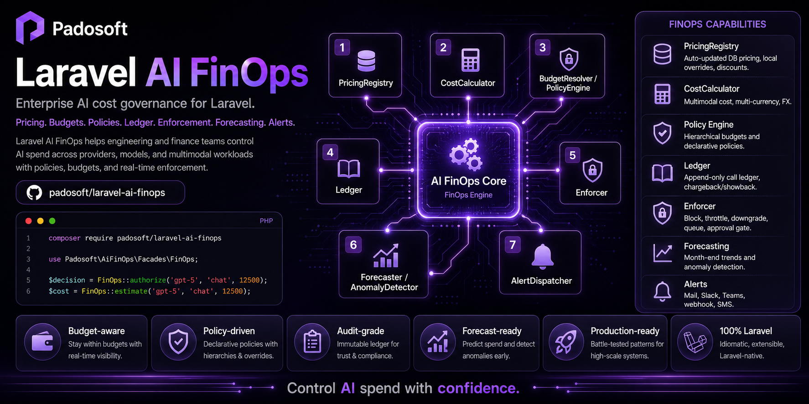
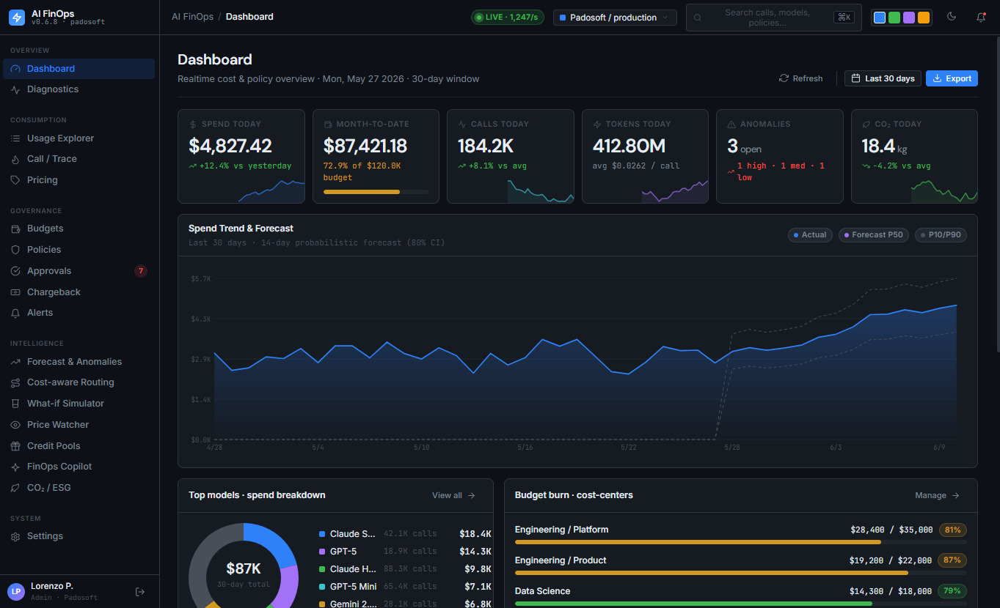

# Laravel AI FinOps

> **Govern every euro your AI spends.** Cross-provider metering, budgets, policy enforcement,
> chargeback, forecasting and cost‑aware routing for Laravel — the FinOps/governance brick for AI agents.

<p>
  <a href="https://github.com/padosoft/laravel-ai-finops/actions/workflows/ci.yml"></a>
  
  
  
  
</p>



`laravel-ai-finops` plugs into the official [`laravel/ai`](https://github.com/laravel/ai) SDK at a
**single point** and meters **every** AI call — any provider, any model — then lets you set budgets,
enforce policies, attribute spend, forecast overruns and route by quality‑per‑dollar. It is
**zero‑hard‑dependency** on the rest of your stack: every sibling integration is an opt‑in seam.

---

## Table of Contents
- [Why it's different](#why-its-different)
- [Quick start](#quick-start)
- [How it works](#how-it-works)
- [Features](#features)
- [Web Admin Panel](#web-admin-panel)
- [API overview](#api-overview)
- [Artisan commands](#artisan-commands)
- [Integrations (opt‑in seams)](#integrations-optin-seams)
- [Configuration](#configuration)
- [Testing](#testing)
- [License](#license)

---

## Why it's different

Most tools either **track** cost or **block** it. This package does both, and goes further:

- 🎯 **One hook, every provider.** A single listener on the `laravel/ai` lifecycle meters OpenAI,
  Anthropic, Gemini, Mistral, DeepSeek, xAI, Bedrock, Azure, **and `padosoft/laravel-ai-regolo`** —
  no per‑provider wiring.
- 💸 **Always‑fresh, multi‑source pricing.** LiteLLM's 2,600+ model price DB **⊕ OpenRouter's live
  models API ⊕ your local manual prices** (for feed‑less providers like **regolo.ai** — EUR / per‑1M
  entry). A per‑provider authority map picks *who actually bills you*; unmapped providers fall back
  to the **freshest‑synced** feed (env‑configurable tie‑break). Manual overrides always win. Never
  ship stale hard‑coded prices again.
- 🧾 **Flat‑rate subscription coverage.** Pay a monthly plan (Claude Max, OpenAI Pro…)? Define a
  `[from, to]` window per provider and calls are metered at **€0** while covered (tokens still
  tracked); routing prefers covered providers to "stay within the plan", and you shorten the window
  the moment the provider says the quota is spent. Plus an optional per‑provider overhead % (e.g.
  OpenRouter's ~5.5% credit fee) folded into estimates — the raw ledger stays pass‑through.
- 🧱 **N‑scope budgets** (global → tenant → user → cost‑center → provider → model → agent → purpose) ×
  periods (daily…yearly + rolling), with soft/hard limits. A hard budget blocks further calls with
  HTTP **402**; pass a pre‑flight cost estimate (or use `diagnostics/estimate`) to also block the
  single call that *would* exceed.
- 🛡️ **Policy DSL + approvals** — declarative `block / require_approval / downgrade / throttle / queue`
  with a human approval workflow; scoped **kill switches**; HTTP **402** enforcement.
- 🧠 **Cost‑aware routing** — pick the cheapest model that clears a quality bar (quality from
  `eval-harness`).
- 🔮 **Forecasting & anomalies**, 🧪 **what‑if simulator** (replay traffic re‑priced on another model),
  📡 **live streaming meter with mid‑stream cutoff**, 🌱 **CO₂/ESG footprint**, 💳 **prepaid credit
  pools**, 📈 **provider price‑change watcher**, 🗣️ **NL FinOps copilot**.
- 🧾 **Chargeback/showback**, immutable **audit trail**, multi‑currency, multi‑tenant, GDPR‑friendly.
- 🔗 **Agentic glue** — a `trace‑id` + per‑step attribution stamps every call in an agent run, so a
  `laravel-flow` run's cost is broken down step‑by‑step under one trace.

Everything is **config‑toggleable** and **EU‑compliant by default**.

---

## Quick start

```bash
composer require padosoft/laravel-ai-finops
php artisan vendor:publish --tag=ai-finops-config
php artisan vendor:publish --tag=ai-finops-migrations
php artisan migrate
```

That's it — if you're already using `laravel/ai`, **metering starts automatically**. Every agent
prompt, embedding and stream is priced and written to the usage ledger.

Add a budget and watch enforcement kick in:

```php
use Padosoft\LaravelAiFinOps\Models\Budget;

Budget::create([
    'name' => 'Monthly cap', 'scope_type' => 'global',
    // Budgets compare against spend in the base currency (default USD). Set
    // ai-finops.currency.base (and an FX provider) to budget in another currency.
    'limit_amount' => 500, 'currency' => 'USD', 'period' => 'monthly',
    'soft_limit_pct' => 80, 'hard' => true,
]);
// Once the hard limit is reached, further AI calls abort with HTTP 402.
// Pass a pre-flight estimate to also block the single call that would exceed.
```

Attribute an agent run's cost per step:

```php
app(\Padosoft\LaravelAiFinOps\Support\TraceContext::class)->within(
    ['trace_id' => $runId, 'agent_step' => 'summarize', 'tenant_id' => $tenantId],
    fn () => $agent->respond($prompt), // every laravel/ai call here is metered under this trace+step
);
```

---

## How it works

Each call becomes an **`AiCallEnvelope`** — a provider‑agnostic record (provider, model, tokens,
cost, currency, tenant, cost‑center, agent step, purpose, `trace‑id`). It flows through the hook:

1. **Pre‑flight** — estimate + `PolicyEngine` → `allow | block | throttle | downgrade | queue |
   require‑approval` (kill switches, guardrails, hard budgets, declarative policies).
2. **Post‑flight** — real usage → `CostCalculator` (multi‑source pricing ⊕ overrides ⊕ subscription
   coverage) → append‑only **ledger** (with frozen price provenance: source, exact rates, upstream
   provider) → budgets, forecasts and alerts update.

The envelope is also the **cross‑package contract**: any Padosoft package can populate its context
tags so FinOps attributes and governs spend consistently.

---

## Features

| Area | What you get |
|------|--------------|
| Metering | Single `laravel/ai` hook; immutable usage ledger; multimodal token tracking |
| Pricing | Multi‑source: LiteLLM ⊕ OpenRouter (live) ⊕ manual (regolo, EUR/per‑1M); per‑provider authority map → freshest‑sync → env tie‑break; overrides win; cache/discount aware |
| Subscriptions | Flat‑rate coverage windows → covered calls cost €0 (tokens tracked); per‑provider overhead % for estimates |
| Budgets | N‑scope hierarchy × periods; soft/hard; burndown; in‑flight enforcement |
| Policies | DSL (scope + min‑cost + model) → block/approval/downgrade/throttle/queue; simulate |
| Approvals | Pending → approve/reject workflow |
| Kill switch | Global + per provider/tenant; config or stored |
| Chargeback | Cost centers + allocation report (showback/chargeback) |
| Forecast | Run‑rate projection + will‑exceed/exceed‑on; spike anomaly detection + ack |
| Routing | Quality‑per‑dollar model selection (eval‑harness seam) |
| What‑if | Replay historical traffic re‑priced on a target model → savings |
| Streaming | Live cost meter + mid‑stream cutoff helper |
| Credits | Prepaid pools + top‑up + ledger |
| Alerts | Multi‑channel rules (mail/Slack/Teams/webhook/SMS) at % thresholds |
| Footprint | Energy (kWh) + CO₂e estimate |
| Audit | Immutable log of every governance mutation |
| Copilot | Natural‑language questions over your spend (ai‑chat/AskMyDocs seam) |
| Price watch | Detect provider list‑price changes for watched models |

---

## Web Admin Panel

A **WOW, production-grade web admin panel** ships separately as
[`padosoft/laravel-ai-finops-admin`](https://github.com/padosoft/laravel-ai-finops-admin) — a
React + Vite + Tailwind console that drives every endpoint below: live cost dashboards, budgets &
burndown, policies & approvals, cost-aware routing, forecasting & anomalies, what-if, chargeback,
alerts, credit pools, CO₂/ESG and a natural-language FinOps copilot.



```bash
composer require padosoft/laravel-ai-finops-admin
```

Then open `/admin/ai-finops`. The panel consumes this package's API (session + CSRF) — no mocks.

---

## API overview

All endpoints are mounted under `config('ai-finops.routes.prefix')` (default `api/ai-finops`, i.e.
URL path `/api/ai-finops`). The public `health` probe is open; every other endpoint is wrapped with
`auth_middleware`.

`usage` · `usage/{id}` · `usage/{traceId}/trace` · `pricing/*` · `budgets/*` · `policies/*` ·
`approvals/*` · `cost-centers` · `chargeback/report` · `routing/*` · `forecast` · `anomalies` ·
`whatif/*` · `footprint/*` · `credits/pools/*` · `alerts/*` · `price-watch/*` · `copilot/*` ·
`audit` · `settings` · `settings/kill-switch` · `diagnostics/estimate` · `dashboard/*`

> The companion **`laravel-ai-finops-admin`** (React + Vite + Tailwind) consumes this surface.

---

## Artisan commands

```bash
php artisan ai-finops:report --days=30     # spend summary
php artisan ai-finops:prune --days=730     # ledger retention
php artisan ai-finops:check-alerts         # evaluate alert thresholds (schedule it)
php artisan ai-finops:capture-prices       # snapshot watched model prices
```

---

## Integrations (opt‑in seams)

No hard dependency on sibling packages — bind an adapter to enable each:

| Contract | Enables | Backed by |
|----------|---------|-----------|
| `QualityScoreProvider` | cost‑aware routing | `padosoft/eval-harness` |
| `GuardrailProvider` | guardrail‑linked spend | `laravel-pii-redactor` / `laravel-ai-act-compliance` |
| `CopilotProvider` | NL FinOps copilot | `laravel-ai-chat` / `AskMyDocs` |

```php
$this->app->singleton(\Padosoft\LaravelAiFinOps\Contracts\QualityScoreProvider::class, MyEvalHarnessScores::class);
```

Then flip the matching toggle under `config('ai-finops.integrations.*')` / `features.*`.

---

## Configuration

`config/ai-finops.php` toggles everything: master `enabled` / `metering` / `enforcement`, scoped
`kill_switch`, multi‑tenancy resolver, currency + FX, pricing source, per‑feature flags, alert
channels, footprint factors, retention. Sensible, EU‑friendly defaults out of the box.

---

## Testing

```bash
composer install
vendor/bin/phpunit          # Unit + Feature + E2E
vendor/bin/pint --test      # code style
```

The suite is hermetic (no network) and runs on PHP 8.3 / 8.4 / 8.5 in CI.

---

## License

Apache‑2.0 © [Padosoft](https://github.com/padosoft)
