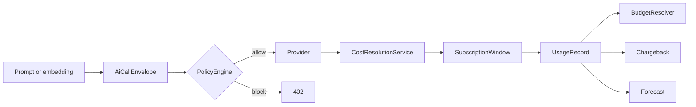

# Design

## Motivazione

Provider-specific integrations fragment governance. A single hook on `laravel/ai` preserves one envelope contract and one ledger.

## Teoria

The design treats a call as both a technical event and a financial event. Every decision uses immutable context:

$$
envelope = provider + model + usage + context + trace
$$

## Mermaid design

## Modello dati/contratto

The envelope contract includes provider, model, token usage, cost breakdown, currency, tenant, user, cost center, agent step, purpose, trace id, status, and metadata.

::: collapsible "ADR: single hook"
Chosen because `laravel/ai` is already the shared Padosoft AI backbone and provider abstraction. Per-provider adapters would duplicate logic and miss compatible providers.
:::

::: collapsible "ADR: optional seams"
Chosen because quality scoring, guardrails, and copilots should integrate without hard dependencies on sibling packages.
:::

## Worked example

The `worked-example` guide creates a tenant budget, adds trace context, and reads trace-cost rows back through the API.

::: callout warning "Limit" icon:triangle-alert
Advisory actions such as `downgrade`, `throttle`, and `queue` require host app cooperation unless the host binds an execution strategy around those decisions.
:::

