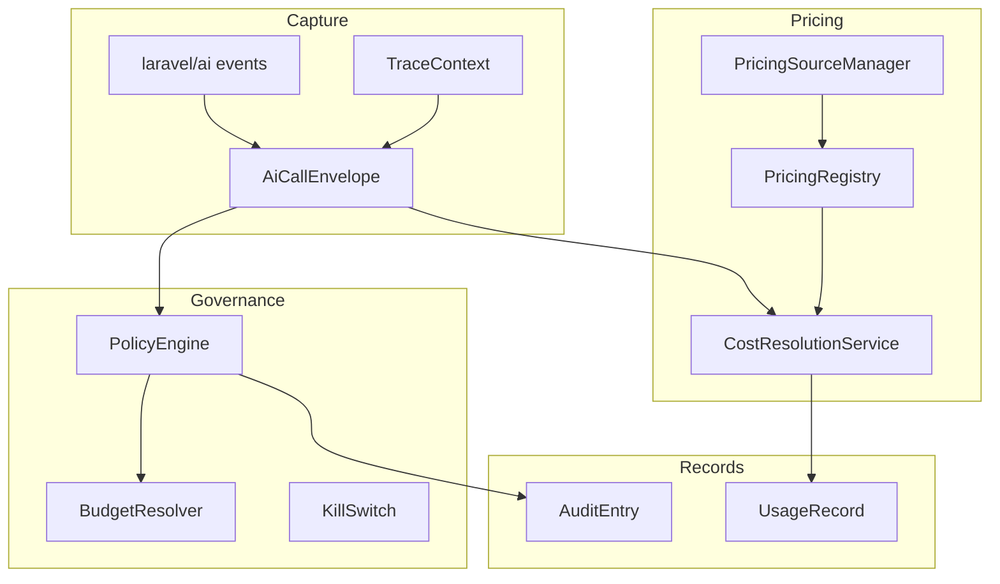

# Architecture Overview

The package separates capture, policy, pricing, ledger, analytics, and optional integrations.

## Boundaries

| Layer | Owns |
| --- | --- |
| `Metering` | Event listening and envelope construction |
| `Policies` | Kill switches, budgets, and policy decisions |
| `Pricing` | Price source sync, resolution, and cost calculation |
| `Ledger` | Append-only usage persistence |
| `Http\Controllers` | API surface consumed by admins and automation |
| `Contracts` | Optional seams for quality, guardrails, copilot, token estimation, and actual cost |

