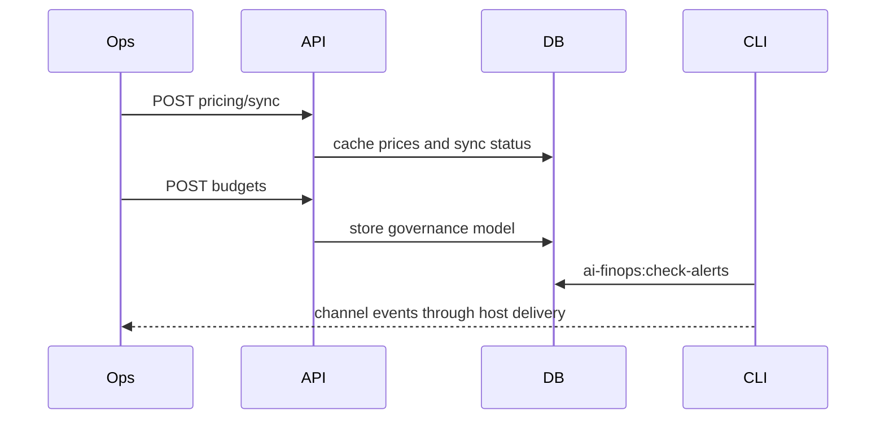

# Pipeline & Workflow

## Runtime workflow

::: steps
1. **Pre-flight event**
   `laravel/ai` emits a request event. FinOps builds context and consults `PolicyEngine`.
2. **Decision**
   The engine allows, blocks, requires approval, or returns advisory actions such as downgrade, throttle, or queue.
3. **Provider response**
   The AI provider returns content and usage. Optional raw response capture stores provider billed cost metadata.
4. **Cost resolution**
   `CostResolutionService` picks actual, computed, or estimated cost.
5. **Coverage**
   Active subscription windows can mark the row covered and zero the FinOps cost.
6. **Persistence and fan-out**
   `DatabaseUsageRecorder` appends the ledger row. Dashboards, forecasts, alerts, and reports query from it.
:::

## Operations workflow

