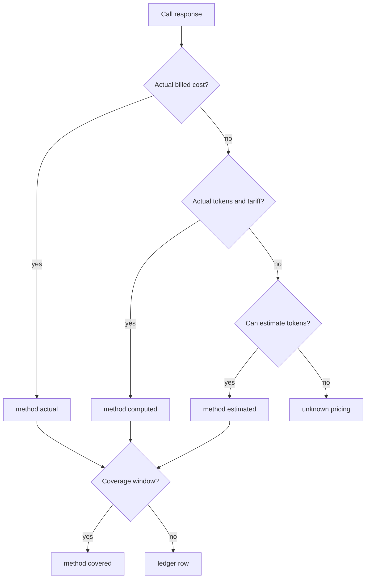

# Cost Cascade

The cascade records the truest cost available for each call.

::: steps
1. **Actual**
   Use provider-billed cost recovered from raw response usage, such as OpenRouter `usage.cost`.
2. **Computed**
   Multiply actual tokens by resolved tariff.
3. **Estimated**
   Estimate tokens from prompt and response text, then multiply by tariff.
4. **Covered**
   Apply a flat-rate subscription window and store cost as zero while preserving tokens.
:::

::: callout tip "Audit fields" icon:file-search
Inspect `cost_method`, `tokens_estimated`, `billed_cost`, `billed_currency`, and frozen rate fields before comparing ledger values to provider invoices.
:::

