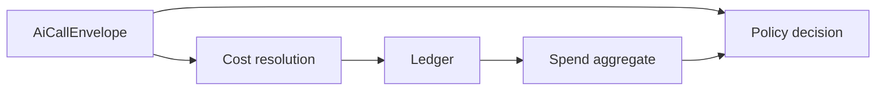

# Teoria FinOps AI

AI FinOps applica controllo finanziario a workload probabilistici. In un'app Laravel il punto corretto e la lifecycle API di `laravel/ai`, perche concentra provider, modello, request, response e usage.

## Equazione operativa

$$
spend_{scope,period} = \sum_{calls} cost\_total
$$

La governance confronta `spend` con budget e policy:

$$
decision = f(scope, period, spend, estimate, policy, kill\_switch)
$$

## Design

::: collapsible "ADR: ledger first"
The package stores an append-only usage ledger before deriving dashboards. This preserves auditability and makes forecasts, chargeback, anomalies, and what-if projections reproducible.
:::

::: callout warning "Limite teorico" icon:circle-alert
Pre-flight control cannot know final output tokens unless the call is constrained or estimated. Use estimates for prospective enforcement and keep the final ledger as source of truth.
:::

