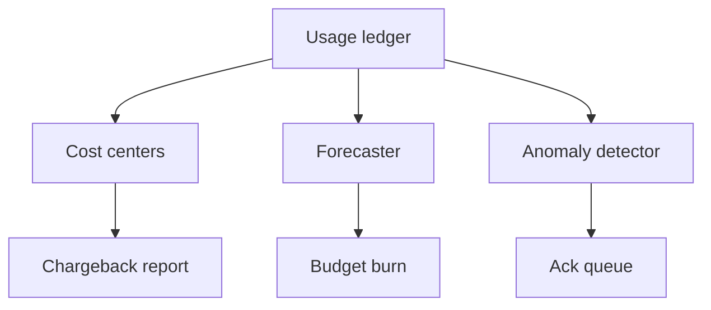

# Chargeback & Forecast

Chargeback turns ledger rows into cost-center accountability. Forecasting turns the same rows into run-rate projections, overrun dates, and anomaly review queues.

## Allocation model

Cost-center CRUD is exposed under `/cost-centers`. Reports are exposed under `/chargeback/report` and include an unallocated bucket when rows do not carry a cost center.

## Forecast model

The forecaster projects spend by period using observed spend and elapsed time. A simple run-rate equation is:

$$
projected = current\_spend \times {period\_length \over elapsed\_time}
$$

::: callout warning "Interpretation" icon:chart-no-axes-column
Forecasts are operational signals, not invoices. Pair them with actual-cost cascade fields before sending executive chargeback numbers.
:::

