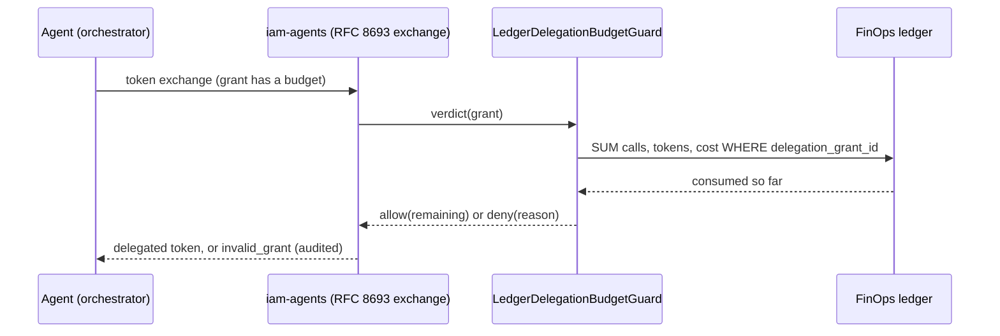

# Delegation budgets — the meter behind IAM delegated access

[`laravel-iam-agents`](https://github.com/padosoft/laravel-iam-agents) lets a user delegate part
of their authority to an AI agent through a consented **delegation grant**. Since v1.1 that grant
can carry a **budget** (amount / tokens / calls) approved inside the same cryptographically bound
consent: *scopes limit authority, budgets limit intensity*.

FinOps is the meter. This package already attributes every AI call to a ledger row — the
integration adds one attribution key (`delegation_grant_id`) and one guard that answers, at every
token exchange, *"has this grant consumed its budget?"*



Delegated tokens are short-lived (≤ 5 min) and re-exchanged, so an exhausted budget stops the
agent **within one token TTL** — no long-lived token keeps spending after the cap.

## Enabling

```php
// config/ai-finops.php
'integrations' => [
    'iam_delegation' => ['enabled' => true],
],
```

Requires `padosoft/laravel-iam-contracts` (^1.4) to be installed — the binding is double-gated on
the toggle **and** the contract's presence, so the package stays zero-coupled when the IAM suite
is absent. When enabled, the service provider binds
`Padosoft\Iam\Contracts\Delegation\DelegationBudgetGuard` to `LedgerDelegationBudgetGuard`.

**Fail-closed on the IAM side:** a grant *with* a budget and *no* guard bound makes iam-agents
refuse the exchange (`delegation_budget_unenforceable`). Turning the toggle on is what makes
budgeted grants usable at all.

## Attributing calls to a grant

Every metered call that runs under a delegated token should carry the grant id (the token's
`pds_dgr` claim). Two ways:

**Ambient — via `TraceContext`** (how laravel-flow / your orchestrator wraps a unit of work):

```php
app(TraceContext::class)->within([
    'trace_id' => $runId,
    'delegation_grant_id' => $claims['pds_dgr'],
], fn () => $agent->run($task));
```

Every call metered inside the scope is stamped automatically, and the previous context is
restored after — nested scopes behave.

**Explicit — on the envelope** (manual reporting):

```php
new AiCallEnvelope(
    traceId: $runId,
    provider: 'openai',
    model: 'gpt-5.1',
    delegationGrantId: $claims['pds_dgr'],
);
```

The ledger gains an indexed `delegation_grant_id` column (nullable — non-delegated calls are
untouched), so the guard's SUM stays cheap at exchange frequency.

## How the verdict is computed

| Cap on the grant | Consumed = | Denied when |
| --- | --- | --- |
| `calls` | `COUNT(*)` of the grant's ledger rows | consumed ≥ cap → `calls 3/3` |
| `tokens` | `SUM(tokens_input + tokens_output + tokens_reasoning)` | consumed ≥ cap → `tokens 1000/1000` |
| `amount` | `SUM(cost_total)` converted from the FinOps base currency into the **budget's** currency via `FxConverter` | consumed ≥ cap → `amount 20.00/20.00 EUR` |

Caps are independent: the first exhausted one denies. An allow verdict carries the `remaining`
counters (informative — for UIs and logs; only `allowed` authorizes). The deny reason is audited
by iam-agents (`delegation_budget_exhausted: …`) and never shown raw to the agent.

The guard is a **point-in-time read** of the append-only ledger — nothing is reserved, the ledger
stays the single source of truth. A call in flight when the cap is crossed still lands in the
ledger (spend visibility is never lost); it is the *next exchange* that gets refused.

## Chargeback per (user, agent)

Because the grant binds one user to one agent, `delegation_grant_id` is also the pivot for
delegated-spend chargeback: group ledger rows by grant to see what each agent spent *on behalf of
whom*, alongside the existing tenant / cost-center dimensions.
