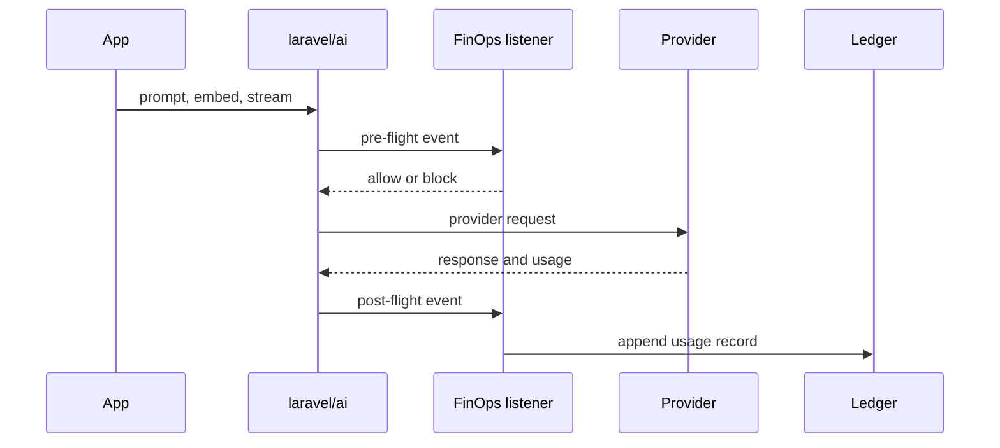

# Metering

Metering listens to the `laravel/ai` lifecycle rather than provider SDKs. That keeps the integration stable across providers and lets every call become an `AiCallEnvelope`.

## Captured context

| Field | Source |
| --- | --- |
| provider and model | `laravel/ai` event metadata |
| tokens | provider usage or estimator fallback |
| cost | cost resolution cascade |
| tenant, user, cost center | configured resolver or trace context |
| trace and agent step | `TraceContext` |
| purpose | explicit metadata |

::: callout tip "Agent step attribution" icon:workflow
Wrap each agent step in `TraceContext::within()` so one run can be reported as a cost flame graph by `trace_id`.
:::

## Beyond the run total

Metering records **one priced row per call**. For where inside a run that cost went, how long each
tool took, what a run that failed had already spent, and which run called which — see
[Run Observability](/guides/run-observability), which needs `laravel/ai` ^0.11.
