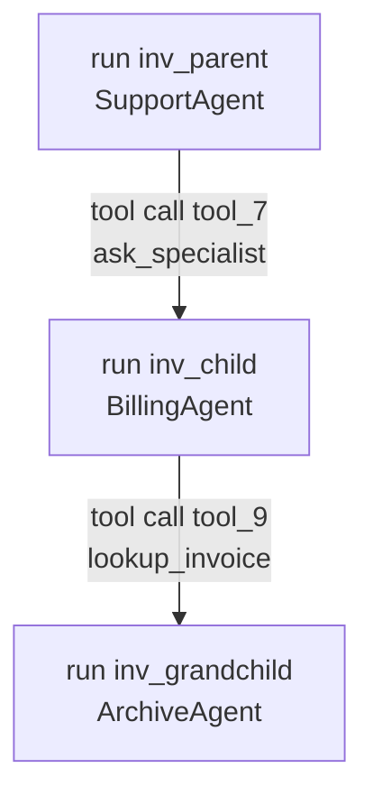

# Run Observability

Metering answers *what did this run cost*. It answers it from one event, `AgentPrompted`, which
fires when a run succeeds. That leaves three questions it structurally cannot answer, and
`laravel/ai` **0.11** added the events that do.

::: callout info
Needs `laravel/ai` **^0.11**. On older versions the listener is never registered — the rest of the
package works exactly as before, it just has nothing to fill this table with.
:::

## The three gaps this closes

### Where the cost went

Usage now arrives **per step**. A five-step agent run used to be a single number in the ledger; the
`run_events` table holds one row per step, with its own tokens, its own price and its own wall time.

### What a failed run cost

A run that dies part-way **never dispatches `AgentPrompted`**. Every token it had already burned was
real, charged by the provider, and missing from the ledger — the month's total was quietly short.

`RunObserver` accumulates each completed step and, when `AgentFailed` lands, writes one ledger row
with `status = failed`, the summed tokens and the exception class in its metadata.

::: callout tip
`laravel/ai` only dispatches `AgentFailed` once a failure is **terminal** — a failover that still has
a provider left to try does not reach it. So a run that fails over three times and then succeeds is
billed once, by the success path, and never double-counted.
:::

### Which tool is slow, and which one throws

Tool wall time is not on the response object at all, and neither is a tool's exception. Both are on
the events. The duration is recorded on the **failed** rows too, which is the number that tells a
nine-second timeout apart from an instant rejection.

## The who-called-whom chain

When an agent is used as a tool of another agent, `laravel/ai` runs the child inside
`ParentInvocation::within(...)`. Every event the child emits therefore knows two things: the
invocation it was delegated **from**, and the exact **tool call** that delegated it.



Both directions are queryable:

```php
use Padosoft\LaravelAiFinOps\Models\RunEvent;

// The runs this one delegated to.
RunEvent::query()->where('parent_invocation_id', $invocationId)->get();

// Everything that happened inside one run.
RunEvent::query()->where('invocation_id', $invocationId)->orderBy('id')->get();
```

## Why it is not in the usage ledger

The usage ledger is the **cost record**: one row per billed call, and sixteen places in this package
sum it. Writing step and tool rows into it would double every total in every dashboard on the day
you upgraded.

So run events live in their own table and join back on `invocation_id`. That column was also added
to the ledger, because `trace_id` is the *ambient* trace when one is set — `laravel-flow` sets one
per step — and the provider's own id was being overwritten. Now a ledger row can always be placed
inside the run it belongs to, whatever the ambient trace decided to call it.

## Endpoints

| Endpoint | What it returns |
|---|---|
| `GET runs` | One row per invocation: agent, provider, model, step count, tool count, failures, cost, duration. `?failed_only=1` and `?tenant_id=` narrow it |
| `GET runs/{invocationId}` | The run in full: steps in order, tools, the ledger rows billed against it, the run that called it, and the runs it delegated to |

Tools are returned **alongside** the steps rather than nested under one. `laravel/ai` reports a tool
invocation against the run, not against the step that asked for it — nesting them would be a guess
presented as a fact.

## Configuration

```php
'run_events' => [
    'enabled' => env('AI_FINOPS_RUN_EVENTS', true),

    // Exception messages are provider text and can quote the prompt back at you.
    'capture_error_messages' => env('AI_FINOPS_RUN_EVENT_ERROR_MESSAGES', true),
    'error_message_limit' => env('AI_FINOPS_RUN_EVENT_ERROR_LIMIT', 500),
],
```

Observability must never be the reason a run fails: every handler swallows its own errors, and so
does the writer. A missing table or a database briefly away costs you rows, not requests.
