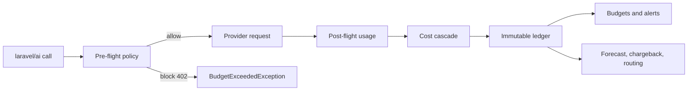

# laravel-ai-finops

`padosoft/laravel-ai-finops` is an Apache-2.0 Laravel package by Padosoft for governing AI spend across providers. It hooks the official `laravel/ai` lifecycle once, records every call in an immutable ledger, and turns usage into budgets, policy enforcement, chargeback, forecasting, routing, alerts, and audit evidence.

::: callout tip "Core promise" icon:badge-euro
One hook meters every `laravel/ai` provider, including OpenAI, Anthropic, Gemini, OpenRouter, regolo.ai, and compatible custom providers.
:::

::: grids
  ::: grid
    ::: card "Meter every call" icon:activity
    Normalize prompts, embeddings, streams, tokens, provider, model, tenant, purpose, and trace context into `AiCallEnvelope`.
    :::
  :::
  ::: grid
    ::: card "Govern spend" icon:shield-check
    Enforce hard budgets, kill switches, policies, approvals, and scoped limits before uncontrolled cost accumulates.
    :::
  :::
  ::: grid
    ::: card "Explain cost" icon:coins
    Resolve cost through actual billed values, token tariffs, estimates, manual overrides, and flat-rate coverage windows.
    :::
  :::
:::

## Start here

::: steps
1. **Install the package**
   Add the Composer package, publish configuration and migrations, then migrate.
2. **Let metering run**
   Existing `laravel/ai` calls are metered automatically when the package is enabled.
3. **Add governance**
   Configure budgets, policy actions, kill switches, alerts, pricing feeds, and cost centers.
4. **Operate from evidence**
   Use the API and CLI to inspect usage, chargeback, forecasts, anomalies, routing, and audit history.
:::

## Architecture at a glance

The cost cascade can be summarized as:

$$
cost = actual\_billed \;|\; tokens \times tariff \;|\; estimated\_tokens \times tariff
$$

## Package facts

| Field | Value |
| --- | --- |
| Composer package | `padosoft/laravel-ai-finops` |
| PHP | `^8.3` |
| Laravel components | `^12.0 || ^13.0` |
| `laravel/ai` compatibility | `^0.6.8 || ^0.7` as a development integration |
| License | Apache-2.0 |
| Repository | `https://github.com/padosoft/laravel-ai-finops` |

