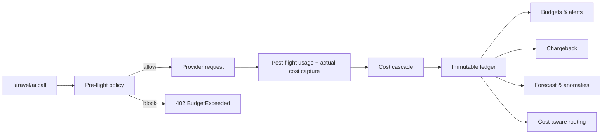

# laravel-ai-finops


> **laravel-ai-finops turns the official `laravel/ai` SDK into a governed, audited cost control plane.**
> One hook meters **every** AI call — any provider, any model — then sets budgets, enforces policies in
> flight, attributes spend per tenant and per agent step, forecasts overruns and routes by
> quality-per-euro. Self-hosted, multi-tenant, EU-compliant by design.

::: callout info "New here? Read this page top to bottom" icon:compass
In five minutes you'll know exactly what this package is, the problem it solves, why it beats every
"just track the tokens" alternative, and where to click next. Every other page goes deeper — this one
gives you the whole picture.
:::

---

## What it is — in one minute

If you ship AI features on Laravel, your spend is **invisible until the invoice arrives**. The official
`laravel/ai` SDK normalizes every response to *tokens only* and throws away the provider's real billed
cost. There is no budget, no per-tenant attribution, no kill switch, no forecast — just a number you
discover at the end of the month.

`laravel-ai-finops` plugs into the `laravel/ai` lifecycle at a **single point** and gives the
non-deterministic, fast-growing part of your bill the same controls your business logic has always had:

- **Meter every call** — normalize provider, model, tokens, tenant, cost-center, agent step, purpose and
  `trace-id` into one immutable `AiCallEnvelope`, written to an append-only ledger.
- **Govern spend before it happens** — hard budgets, kill switches, a declarative policy DSL and human
  approvals block runaway cost *in flight* (HTTP `402`), not after the fact.
- **Explain every euro** — a truest-cost cascade prices each call by the best number available, and
  records *which* method it used so you can tell an invoiced fact from a tariff estimate.

> **In one line:** *the FinOps brick `laravel/ai` is missing — meter, budget, enforce, attribute and
> forecast AI spend across every provider, from inside your own Laravel app.*

---

## The problem it solves

Every team shipping AI hits the same wall: cost is untracked, unattributed and unstoppable. Here is the
gap this package closes.

| Without laravel-ai-finops | With laravel-ai-finops |
|---|---|
| `laravel/ai` keeps tokens and **discards the provider's real billed cost** — you can never reconcile the invoice. | A global capture recovers `usage.cost` (e.g. OpenRouter) **before it's dropped**; the truest number wins. |
| "Cost" is one number you see at month-end, after the money is gone. | A live, append-only ledger prices **every** call as it happens — by tenant, agent step, model and purpose. |
| A runaway agent loop bills thousands before anyone notices. | **Hard budgets + kill switches** abort the next call with HTTP `402`; a pre-flight estimate blocks the call that *would* exceed. |
| Pricing is hard-coded and instantly stale across 2,600+ models. | Multi-source pricing — **LiteLLM ⊕ OpenRouter live ⊕ your manual overrides** — with a per-provider authority map and freshest-sync tie-break. |
| Paying a flat-rate plan (Claude Max, OpenAI Pro)? You still "pay" per token in your reports. | **Subscription coverage windows** meter covered calls at **€0** while active (tokens still tracked). |
| You can't tell finance what each team, tenant or feature actually costs. | **Chargeback/showback** by cost-center, multi-currency, with an immutable audit trail. |
| No way to know if you'll blow the budget next week. | **Forecasting, anomaly detection and a what-if simulator** that replays traffic re-priced on another model. |

---

## Who it's for

::: grids
  ::: grid
    ::: card "Teams shipping laravel/ai in production" icon:rocket
    Already using the official SDK? Metering starts automatically the moment the package is enabled — zero per-provider wiring, zero code changes to your agents.
    :::
  :::
  ::: grid
    ::: card "Multi-tenant SaaS" icon:layers
    Attribute and cap spend per tenant, user, cost-center and brand. Per-tenant kill switches and chargeback reports your finance team can actually use.
    :::
  :::
  ::: grid
    ::: card "Agentic systems" icon:workflow
    A `trace-id` + per-step attribution breaks an entire agent run's cost down step-by-step under one trace — pairs natively with `laravel-flow`.
    :::
  :::
  ::: grid
    ::: card "FinOps & platform engineering" icon:scale
    Budgets, policy-as-code, forecasts, ESG footprint and cost-aware routing — the governance layer that turns AI from an unbounded liability into a managed line item.
    :::
  :::
:::

---

## Why it's different — the moats

Most tools either **track** cost or **block** it. This package does both, self-hosted, and goes further
than anything in the Laravel ecosystem.

::: grids
  ::: grid
    ::: card "One hook, every provider" icon:activity
    A single listener on the `laravel/ai` lifecycle meters OpenAI, Anthropic, Gemini, Mistral, DeepSeek, xAI, Bedrock, Azure **and `padosoft/laravel-ai-regolo`** — no per-provider integration code.
    :::
  :::
  ::: grid
    ::: card "We recover the cost laravel/ai throws away" icon:badge-euro
    The SDK normalizes responses to tokens and **drops the real billed cost**. A global HTTP capture reads the provider's `usage.cost` before it's discarded — so each call is priced by the truest number that exists.
    :::
  :::
  ::: grid
    ::: card "Truest-cost cascade, with provenance" icon:coins
    Every row is priced **(a) actual billed → (b) tokens × tariff → (c) estimated tokens × tariff** and records `cost_method` + `tokens_estimated` + `billed_cost`. You always know invoiced truth from estimate.
    :::
  :::
  ::: grid
    ::: card "Multi-source, never-stale pricing" icon:refresh-cw
    LiteLLM's 2,600+ model DB ⊕ OpenRouter's live API ⊕ your local EUR/per-1M overrides. A per-provider authority map picks who actually bills you; overrides always win.
    :::
  :::
  ::: grid
    ::: card "In-flight enforcement (HTTP 402)" icon:shield-check
    N-scope budgets (global → tenant → user → cost-center → provider → model → agent → purpose) × periods, soft/hard. A hard limit blocks the **next** call — and, with a pre-flight estimate, the one that would exceed.
    :::
  :::
  ::: grid
    ::: card "Policy DSL + human approvals" icon:scale
    Declarative `block / require_approval / downgrade / throttle / queue` rules with an approval workflow and scoped kill switches — governance as code, simulatable before you ship it.
    :::
  :::
  ::: grid
    ::: card "Flat-rate subscription coverage" icon:wallet
    Define a `[from, to]` window per provider and covered calls are metered at **€0** while your plan is active — routing even prefers covered providers to "stay within the plan".
    :::
  :::
  ::: grid
    ::: card "Cost-aware routing by quality-per-euro" icon:route
    Pick the cheapest model that clears a quality bar (scores sourced from `padosoft/eval-harness`) — spend the minimum that still meets your standard.
    :::
  :::
  ::: grid
    ::: card "Forecast, what-if, ESG & more" icon:chart-line
    Run-rate forecasting, spike anomaly detection, a what-if simulator, live streaming meter with mid-stream cutoff, CO₂/ESG footprint, prepaid credit pools, price-change watcher and a natural-language FinOps copilot.
    :::
  :::
:::

---

## See it: the FinOps cockpit

A production-grade web admin panel ships separately as
[`padosoft/laravel-ai-finops-admin`](https://github.com/padosoft/laravel-ai-finops-admin) — a
React + Vite + Tailwind console driving every endpoint: live cost dashboards, budgets and burndown,
policies and approvals, cost-aware routing, forecasting and anomalies, what-if, chargeback, alerts,
credit pools, CO₂/ESG and a natural-language copilot. It consumes this package's API directly — no mocks.


---

## laravel-ai-finops vs. the alternatives

| Capability | **laravel-ai-finops** | DIY logging | LLM gateways (Helicone / Langfuse) | Cloud cost tools (Vantage / CloudZero) |
|---|:---:|:---:|:---:|:---:|
| Single hook over the official `laravel/ai` SDK | ✅ | ❌ | ➖ | ❌ |
| Recovers the provider's real billed cost | ✅ | ❌ | ➖ | ➖ |
| In-flight hard-budget block (HTTP 402) | ✅ | ❌ | ➖ | ❌ |
| Policy DSL + human approvals | ✅ | ❌ | ❌ | ➖ |
| Flat-rate subscription €0 coverage windows | ✅ | ❌ | ❌ | ❌ |
| Cost-aware routing by quality-per-euro | ✅ | ❌ | ➖ | ❌ |
| Per-tenant + per-agent-step chargeback | ✅ | ➖ | ➖ | ➖ |
| Self-hosted in **your** Laravel DB, you own the data | ✅ | ✅ | ❌ | ❌ |

> Legend: ✅ built-in · ➖ partial / extra cost / not exposed · ❌ not available.

---

## How it fits together

Each call becomes an `AiCallEnvelope` and flows through one hook: pre-flight policy, then post-flight
cost cascade into an immutable ledger that feeds budgets, alerts, forecasts and routing.



The cost cascade picks the truest number available:

$$
cost = actual\_billed \;\;|\;\; tokens \times tariff \;\;|\;\; estimated\_tokens \times tariff
$$

---

## Start in 30 seconds

::: steps
1. **Install the package**
   ```bash
   composer require padosoft/laravel-ai-finops
   php artisan vendor:publish --tag=ai-finops-config
   php artisan vendor:publish --tag=ai-finops-migrations
   php artisan migrate
   ```
   If you already use `laravel/ai`, **metering starts automatically** — every prompt, embedding and
   stream is priced and written to the ledger.

2. **Add a budget and watch enforcement kick in**
   ```php
   use Padosoft\LaravelAiFinOps\Models\Budget;

   Budget::create([
       'name' => 'Monthly cap', 'scope_type' => 'global',
       'limit_amount' => 500, 'currency' => 'USD', 'period' => 'monthly',
       'soft_limit_pct' => 80, 'hard' => true,
   ]);
   // Once the hard limit is reached, further AI calls abort with HTTP 402.
   ```

3. **Attribute an agent run's cost, step by step**
   ```php
   app(\Padosoft\LaravelAiFinOps\Support\TraceContext::class)->within(
       ['trace_id' => $runId, 'agent_step' => 'summarize', 'tenant_id' => $tenantId],
       fn () => $agent->respond($prompt), // every laravel/ai call here is metered under this trace+step
   );
   ```
:::

**[→ Full Quickstart](/get-started/quickstart)** · **[→ Installation](/get-started/installation)** · **[→ Worked Example](/guides/worked-example)**

---

## Batteries included for AI-assisted development

This repo ships **AI batteries** — a `CLAUDE.md` working guide, an `AGENTS.md` workflow contract and
invocable `.claude/skills/` encoding the TDD loop, the metering/pricing rules and the docs-sync
discipline. Open the package in Claude Code, Cursor, Copilot or Codex and your agent already knows the
house rules.

---

## Where to go next

::: grids
  ::: grid
    ::: card "Quickstart" icon:zap
    Install, meter and enforce your first budget in minutes. **[Open →](/get-started/quickstart)**
    :::
  :::
  ::: grid
    ::: card "Concepts & Theory" icon:brain
    Why AI FinOps is its own discipline, and the cost-cascade theory behind every priced row. **[Read →](/concepts/motivazione)**
    :::
  :::
  ::: grid
    ::: card "Architecture" icon:boxes
    The single-hook pipeline, data contract and the ADRs behind the design. **[Explore →](/architecture/overview)**
    :::
  :::
:::

::: callout tip "Package facts" icon:info
Composer `padosoft/laravel-ai-finops` · PHP `^8.3` (8.4/8.5) · Laravel `^12 || ^13` ·
`laravel/ai` `^0.6.8 || ^0.7` · Apache-2.0 ·
[GitHub](https://github.com/padosoft/laravel-ai-finops) · [Packagist](https://packagist.org/packages/padosoft/laravel-ai-finops)
:::
